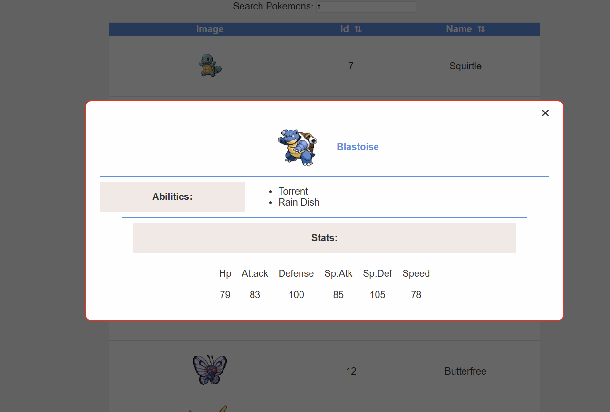

# Pokémon UI

A simple frontend Pokémon browser built with HTML, CSS, and JavaScript.  
This project fetches Pokémon data from the PokéAPI and displays it in a table with search, sorting, pagination, and a modal for Pokémon details.

---

## 🚀 Features

- Fetch and display Pokémon list
- Search Pokémon by name
- Sort by **ID** or **Name** (ascending/descending)
- Pagination
- Modal with Pokémon details
- Modular JavaScript structure (state, render, events, API)
- Responsive layout

---

## 📁 Project Structure

pokemon-ui/
│── index.html  
│── style.css  
│── README.md  
│  
├── /scripts  
│ ├── script.js  
│ ├── pokemon.js  
│ ├── render.js  
│ ├── state.js  
│ ├── search.js  
│ ├── events.js  
│  
└── /assets  
 └── images/

---

## 🔧 Installation

1. Clone the repository:
   git clone https://github.com/yourusername/pokemon-ui

2. Enter the project folder:
   cd pokemon-ui

3. Open the `index.html` file directly in your browser.

---

## 🧩 How It Works

### **1. API (pokemon.js)**

Fetches Pokémon from the PokéAPI.

### **2. State Management (state.js)**

Stores:

- All Pokémon
- Current filtered/sorted list
- Current selected page

### **3. Rendering (render.js)**

Updates:

- Pokémon table
- Pagination
- Modal content

### **4. Events**

Files such as:

- `search.js`
- `events.js`
- `pagination.js`
- `sort.js`
- `showPokemonDetails.js`

handle user interactions (searching, clicking, sorting).

---

## 🖼 Screenshot

---

## 📜 License

This project is open-source and free to use.
